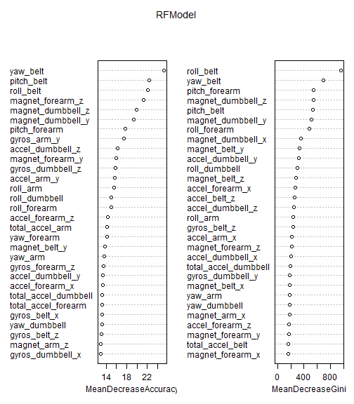
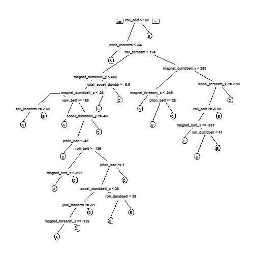

##Can Accelerometers Indicate Proper Form During Unilateral Dumbbell Biceps Curl?

##Synopsis
The goal of this project was to predict the manner in which six participants performed unilateral dumbbell bicep curls while wearing accelerometers (FitBit, Jawbone Up, and Nike FuelBand) by using the Weight Lifting Exercises Dataset provided at http:/groupware.les.inf.puc-rio.br/har from the paper Velloso, E.; Bulling, A.; Gellersen, H.; Ugulino, W.; Fuks, H. Qualitative Activity Recognition of Weight Lifting Exercises. Proceedings of 4th International Conference in Cooperation with SIGCHI (Augmented Human '13) . Stuttgart, Germany: ACM SIGCHI, 2013.  

The six participants were asked to perform one set of 10 repetitions of the Unilateral Dumbbell Biceps Curl in five different fashions: exactly according to the specification (Class A), throwing the elbows to the front (Class B), lifting the dumbbell only halfway (Class C), lowering the dumbbell only halfway (Class D) and throwing the hips to the front (Class E).

To accomplish this goal the Weight Lifting Exercises Dataset was analysed and processed to eliminate NA's and focus on relevant predictor variables excluding the "classe" variable in the training set.  The model was built using the Random Forest algorithm on the variables that were independent (maximum correlation < 60%).  A simple k-fold cross-validation control was used.  The expected out of sample error was estimated to be 2% or less.  20 test observations were then predicted using the model.

##Data Processing - Loading and Processing the Raw Data
Download and load the data.  Files were downloaded from the Practical Machine Language Coursera website from the following links:
The training data for this project are available here: 

https://d396qusza40orc.cloudfront.net/predmachlearn/pml-training.csv

The test data are available here: 

https://d396qusza40orc.cloudfront.net/predmachlearn/pml-testing.csv

```r
#install.packages("caret")
#install.packages("knitr")
#install.packages("corrplot")
#install.packages("ggplot2")
#install.packages("randomForest")
#install.packages("rpart.plot")
#setwd("~/Data Science")
getwd()
```

```
## [1] "C:/Users/brohde/Documents/Data Science/Machine Learning"
```

```r
#library(knitr)
#knit2html("PMLProject.RMD")
```

```r
training<-read.csv("pml-training.csv", na.strings = c("NA", "#DIV/0!", ""))
```

```r
testingkey<-read.csv("pml-testing.csv", na.strings = c("NA", "#DIV/0!", ""))
dim(training)
```

```
## [1] 19622   160
```

```r
dim(testingkey)
```

```
## [1]  20 160
```

```r
head(training, n=2)
```

```
##   X user_name raw_timestamp_part_1 raw_timestamp_part_2   cvtd_timestamp
## 1 1  carlitos           1323084231               788290 05/12/2011 11:23
## 2 2  carlitos           1323084231               808298 05/12/2011 11:23
##   new_window num_window roll_belt pitch_belt yaw_belt total_accel_belt
## 1         no         11      1.41       8.07    -94.4                3
## 2         no         11      1.41       8.07    -94.4                3
##   kurtosis_roll_belt kurtosis_picth_belt kurtosis_yaw_belt
## 1                 NA                  NA                NA
## 2                 NA                  NA                NA
##   skewness_roll_belt skewness_roll_belt.1 skewness_yaw_belt max_roll_belt
## 1                 NA                   NA                NA            NA
## 2                 NA                   NA                NA            NA
##   max_picth_belt max_yaw_belt min_roll_belt min_pitch_belt min_yaw_belt
## 1             NA           NA            NA             NA           NA
## 2             NA           NA            NA             NA           NA
##   amplitude_roll_belt amplitude_pitch_belt amplitude_yaw_belt
## 1                  NA                   NA                 NA
## 2                  NA                   NA                 NA
##   var_total_accel_belt avg_roll_belt stddev_roll_belt var_roll_belt
## 1                   NA            NA               NA            NA
## 2                   NA            NA               NA            NA
##   avg_pitch_belt stddev_pitch_belt var_pitch_belt avg_yaw_belt
## 1             NA                NA             NA           NA
## 2             NA                NA             NA           NA
##   stddev_yaw_belt var_yaw_belt gyros_belt_x gyros_belt_y gyros_belt_z
## 1              NA           NA         0.00            0        -0.02
## 2              NA           NA         0.02            0        -0.02
##   accel_belt_x accel_belt_y accel_belt_z magnet_belt_x magnet_belt_y
## 1          -21            4           22            -3           599
## 2          -22            4           22            -7           608
##   magnet_belt_z roll_arm pitch_arm yaw_arm total_accel_arm var_accel_arm
## 1          -313     -128      22.5    -161              34            NA
## 2          -311     -128      22.5    -161              34            NA
##   avg_roll_arm stddev_roll_arm var_roll_arm avg_pitch_arm stddev_pitch_arm
## 1           NA              NA           NA            NA               NA
## 2           NA              NA           NA            NA               NA
##   var_pitch_arm avg_yaw_arm stddev_yaw_arm var_yaw_arm gyros_arm_x
## 1            NA          NA             NA          NA        0.00
## 2            NA          NA             NA          NA        0.02
##   gyros_arm_y gyros_arm_z accel_arm_x accel_arm_y accel_arm_z magnet_arm_x
## 1        0.00       -0.02        -288         109        -123         -368
## 2       -0.02       -0.02        -290         110        -125         -369
##   magnet_arm_y magnet_arm_z kurtosis_roll_arm kurtosis_picth_arm
## 1          337          516                NA                 NA
## 2          337          513                NA                 NA
##   kurtosis_yaw_arm skewness_roll_arm skewness_pitch_arm skewness_yaw_arm
## 1               NA                NA                 NA               NA
## 2               NA                NA                 NA               NA
##   max_roll_arm max_picth_arm max_yaw_arm min_roll_arm min_pitch_arm
## 1           NA            NA          NA           NA            NA
## 2           NA            NA          NA           NA            NA
##   min_yaw_arm amplitude_roll_arm amplitude_pitch_arm amplitude_yaw_arm
## 1          NA                 NA                  NA                NA
## 2          NA                 NA                  NA                NA
##   roll_dumbbell pitch_dumbbell yaw_dumbbell kurtosis_roll_dumbbell
## 1      13.05217      -70.49400    -84.87394                     NA
## 2      13.13074      -70.63751    -84.71065                     NA
##   kurtosis_picth_dumbbell kurtosis_yaw_dumbbell skewness_roll_dumbbell
## 1                      NA                    NA                     NA
## 2                      NA                    NA                     NA
##   skewness_pitch_dumbbell skewness_yaw_dumbbell max_roll_dumbbell
## 1                      NA                    NA                NA
## 2                      NA                    NA                NA
##   max_picth_dumbbell max_yaw_dumbbell min_roll_dumbbell min_pitch_dumbbell
## 1                 NA               NA                NA                 NA
## 2                 NA               NA                NA                 NA
##   min_yaw_dumbbell amplitude_roll_dumbbell amplitude_pitch_dumbbell
## 1               NA                      NA                       NA
## 2               NA                      NA                       NA
##   amplitude_yaw_dumbbell total_accel_dumbbell var_accel_dumbbell
## 1                     NA                   37                 NA
## 2                     NA                   37                 NA
##   avg_roll_dumbbell stddev_roll_dumbbell var_roll_dumbbell
## 1                NA                   NA                NA
## 2                NA                   NA                NA
##   avg_pitch_dumbbell stddev_pitch_dumbbell var_pitch_dumbbell
## 1                 NA                    NA                 NA
## 2                 NA                    NA                 NA
##   avg_yaw_dumbbell stddev_yaw_dumbbell var_yaw_dumbbell gyros_dumbbell_x
## 1               NA                  NA               NA                0
## 2               NA                  NA               NA                0
##   gyros_dumbbell_y gyros_dumbbell_z accel_dumbbell_x accel_dumbbell_y
## 1            -0.02                0             -234               47
## 2            -0.02                0             -233               47
##   accel_dumbbell_z magnet_dumbbell_x magnet_dumbbell_y magnet_dumbbell_z
## 1             -271              -559               293               -65
## 2             -269              -555               296               -64
##   roll_forearm pitch_forearm yaw_forearm kurtosis_roll_forearm
## 1         28.4         -63.9        -153                    NA
## 2         28.3         -63.9        -153                    NA
##   kurtosis_picth_forearm kurtosis_yaw_forearm skewness_roll_forearm
## 1                     NA                   NA                    NA
## 2                     NA                   NA                    NA
##   skewness_pitch_forearm skewness_yaw_forearm max_roll_forearm
## 1                     NA                   NA               NA
## 2                     NA                   NA               NA
##   max_picth_forearm max_yaw_forearm min_roll_forearm min_pitch_forearm
## 1                NA              NA               NA                NA
## 2                NA              NA               NA                NA
##   min_yaw_forearm amplitude_roll_forearm amplitude_pitch_forearm
## 1              NA                     NA                      NA
## 2              NA                     NA                      NA
##   amplitude_yaw_forearm total_accel_forearm var_accel_forearm
## 1                    NA                  36                NA
## 2                    NA                  36                NA
##   avg_roll_forearm stddev_roll_forearm var_roll_forearm avg_pitch_forearm
## 1               NA                  NA               NA                NA
## 2               NA                  NA               NA                NA
##   stddev_pitch_forearm var_pitch_forearm avg_yaw_forearm
## 1                   NA                NA              NA
## 2                   NA                NA              NA
##   stddev_yaw_forearm var_yaw_forearm gyros_forearm_x gyros_forearm_y
## 1                 NA              NA            0.03               0
## 2                 NA              NA            0.02               0
##   gyros_forearm_z accel_forearm_x accel_forearm_y accel_forearm_z
## 1           -0.02             192             203            -215
## 2           -0.02             192             203            -216
##   magnet_forearm_x magnet_forearm_y magnet_forearm_z classe
## 1              -17              654              476      A
## 2              -18              661              473      A
```
Remove variables that have a majority of NA values and are not relevant to this project.


```
## [1] 19622   153
```

Verify for near zero variance.

```
## Warning: package 'caret' was built under R version 3.1.3
```

```
## Loading required package: lattice
```

```
## Warning: package 'lattice' was built under R version 3.1.3
```

```
## Loading required package: ggplot2
```

```
## Warning: package 'ggplot2' was built under R version 3.1.3
```

```
## [1] 19622    53
```
Cross validation is required so the training set needs to be partitioned into a "training set" (75%) and a "test set" (25%). Note, the caret package will need to be installed from CRAN if it is not loaded. (install.packages("caret") in R)

```
## [1] 14718    53
```

```
## [1] 4904   53
```
To assist in focusing on variables that are key predictors of Bicep Curl form an initial randomForest is run on the training1 dataset with a variable importance plot result.


```r
library(randomForest)
```

```
## Warning: package 'randomForest' was built under R version 3.1.3
```

```
## randomForest 4.6-10
## Type rfNews() to see new features/changes/bug fixes.
```

```r
set.seed(3457)
RFModel<-randomForest(classe~., data=training1, importance=TRUE, ntree=100)
varImpPlot(RFModel)
```

 

From the Accuracy and Gini graph results above, the top 9 variables are selected for model building.  The 9 variables include: yaw_belt, pitch_belt, roll_belt, magnet_forearm_z, magnet_dumbell_z, magnet_dumbell_y, pitch_forearm, gyros_arm_y, roll_forearm.

Next the 9 covariates are analyzed for correlations.


```
##           row col
## roll_belt   2   1
## yaw_belt    1   2
```
There is a correlation over 75% between yaw_belt and roll_belt.  By removing roll_belt and re-running the correlation  script (see below) it is determined the remaining eight variables provide a maximum correlation of 41% which is indicative of independence of the covariates.


```
##      row col
```

```
## [1] 0.4135039
```
Running a tree classifier on the training1 data; roll_belt is listed as the first discriminant among the covariates which indicates that roll_belt should be included in the prediction model and yaw_belt removed.

```
## Warning: package 'rpart.plot' was built under R version 3.1.3
```

```
## Loading required package: rpart
```

 
Running the correlation script again including roll_belt and excluding yaw_belt produces a maximum correlation of 41% which is still indicative of independent covariates.

```
##      row col
```

```
## [1] 0.4135039
```
##Prediction Model
The most significant eight variables are used from the initial Random Forest classification which include: roll_belt, pitch_belt, magnet_forearm_z, magnet_dumbbell_z, magnet_dumbbell_y, pitch_forearm, gyros_arm_y, and roll_forearm. For cross-validation a 2-fold cross-validation control is chosen to maximize run time on this large data set.  The train() function from the caret package is used for this Random Forest algorithm.

```r
controltwo<-trainControl(method="cv",2)
RFcModel<-train(classe ~ roll_belt + pitch_belt + magnet_forearm_z + magnet_dumbbell_z + magnet_dumbbell_y + pitch_forearm + gyros_arm_y + roll_forearm, data=training1, method="rf", trControl=controltwo, ntree=250)
RFcModel
```

```
## Random Forest 
## 
## 14718 samples
##    52 predictor
##     5 classes: 'A', 'B', 'C', 'D', 'E' 
## 
## No pre-processing
## Resampling: Cross-Validated (2 fold) 
## Summary of sample sizes: 7358, 7360 
## Resampling results across tuning parameters:
## 
##   mtry  Accuracy   Kappa      Accuracy SD  Kappa SD   
##   2     0.9735697  0.9665697  0.001062040  0.001335889
##   5     0.9682017  0.9597810  0.005002653  0.006331094
##   8     0.9599123  0.9492947  0.007694692  0.009736764
## 
## Accuracy was used to select the optimal model using  the largest value.
## The final value used for the model was mtry = 2.
```
From the caret package the confusionMatrix()function is applied on the test set (testing1) to determine the model's accuracy.


```r
predictions<- predict(RFcModel, newdata=testing1)
confusionMat <- confusionMatrix(predictions, testing1$classe)
confusionMat
```

```
## Confusion Matrix and Statistics
## 
##           Reference
## Prediction    A    B    C    D    E
##          A 1388    6    0    0    0
##          B    0  922    9    3    3
##          C    4   13  843   15    2
##          D    3    5    3  786    4
##          E    0    3    0    0  892
## 
## Overall Statistics
##                                           
##                Accuracy : 0.9851          
##                  95% CI : (0.9813, 0.9883)
##     No Information Rate : 0.2845          
##     P-Value [Acc > NIR] : < 2.2e-16       
##                                           
##                   Kappa : 0.9812          
##  Mcnemar's Test P-Value : NA              
## 
## Statistics by Class:
## 
##                      Class: A Class: B Class: C Class: D Class: E
## Sensitivity            0.9950   0.9715   0.9860   0.9776   0.9900
## Specificity            0.9983   0.9962   0.9916   0.9963   0.9993
## Pos Pred Value         0.9957   0.9840   0.9612   0.9813   0.9966
## Neg Pred Value         0.9980   0.9932   0.9970   0.9956   0.9978
## Prevalence             0.2845   0.1935   0.1743   0.1639   0.1837
## Detection Rate         0.2830   0.1880   0.1719   0.1603   0.1819
## Detection Prevalence   0.2843   0.1911   0.1788   0.1633   0.1825
## Balanced Accuracy      0.9966   0.9839   0.9888   0.9870   0.9946
```

```r
accuracy <- postResample(predictions, testing1$classe)
accuracy
```

```
##  Accuracy     Kappa 
## 0.9851142 0.9811733
```

```r
oose <- 1 - as.numeric(confusionMatrix(testing1$classe, predictions)$overall[1])
oose
```

```
## [1] 0.01488581
```
The accuracy is 98.5% which substantiates using the smaller subset of significant variables.  The Random Forest algorithm's out-of-sample error rate is calculated as follows: 100% - Prediction Accuracy of .985   = 1.40% which is below the assumed out-of-sample error of 2%.  To improve this predictor additional variables could be included such as magnet_dumbbell_y, magnet_belt_y, and magnet_forearm_y.

##Practical Machine Learning Course Submission
The following 20 observations from the course project submission page are predicted using the Random Forest Algorithm.

```r
final<-predict(RFcModel, newdata=testingkey)
final
```

```
##  [1] B A B A A E D B A A B C B A E E A B B B
## Levels: A B C D E
```
Results submitted to Practical Machine Learning course and provided a 20/20 score for the assignment.


```r
answers <- final
pml_write_files = function (x){
  n = length (x)
  for(i in 1:n){
    filename = paste0("problem_id", i,".txt")
    write.table(x[i], file=filename, quote=FALSE, row.names=FALSE, col.names=FALSE)
  }
}
pml_write_files(answers)
```


